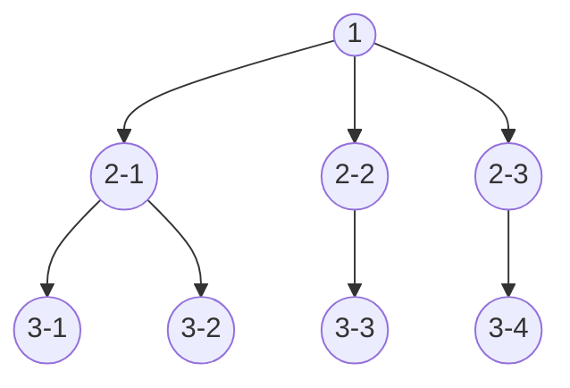
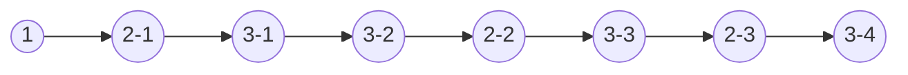
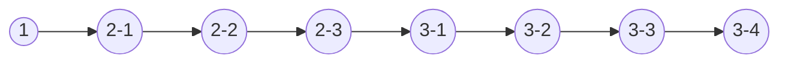

## 什么是深度优先和广度优先
1、概念：深度优先是自上而下的遍历搜索，广度优先则是逐层遍历。比如，现有如下树结构：


* 深度遍历优先的遍历顺序为：


* 广度遍历优先的遍历顺序为：

## 代码实现
1、现有如下树结构数据
```
const tree = {
  data: { no: 1 },
  children: [
    {
      data: { no: 2 .1 },
      children: [
        { data: { no: 3.1 }, children: [] },
        { data: { no: 3.2 }, children: [] }
      ]
    },
    {
      data: { no: 2.2 },
      children: [
        { data: { no: 3.3 }, children: [] }
      ]
    },
    {
      data: { no: 2.3 },
      children: [
        { data: { no: 3.4 }, children: [] }
      ]
    },
  ]
}
```
* 深度优先遍历 采用递归遍历的方式
```
function breadthFirst (data) {
  let result = [];
  result.push(data.data.no);
  function recursion (data) {
    data.forEach(item => {
      result.push(item.data.no);
      item.children && recursion(item.children);
    })
  }
  recursion(data.children);
  return result.join(',');
}
```
* 广度优先遍历 采用队列的方式 先进先出
```
function depthFirst (data) {
  let result = [];
  let queue = data;
  result.push(queue.data.no);
  while (queue.children.length > 0) {
    // first为数组queue.children的第一个值
    const first = queue.children[0];
    result.push(first.data.no);
    // 将第一个值的所有子节点push到数组queue.children的末尾 以达到一层一层遍历的效果
    first.children && (queue.children.push(...first.children));
    // 将数组queue.children的第一个值删除(已遍历)
    queue.children.shift();
  }
  return result.join(',');
}
```

